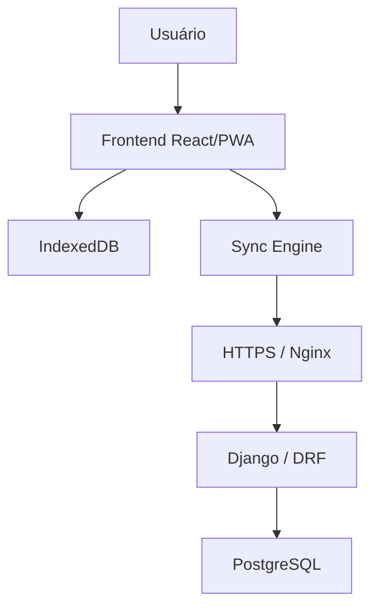
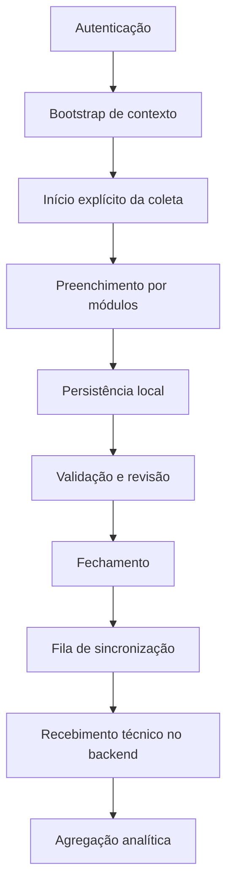
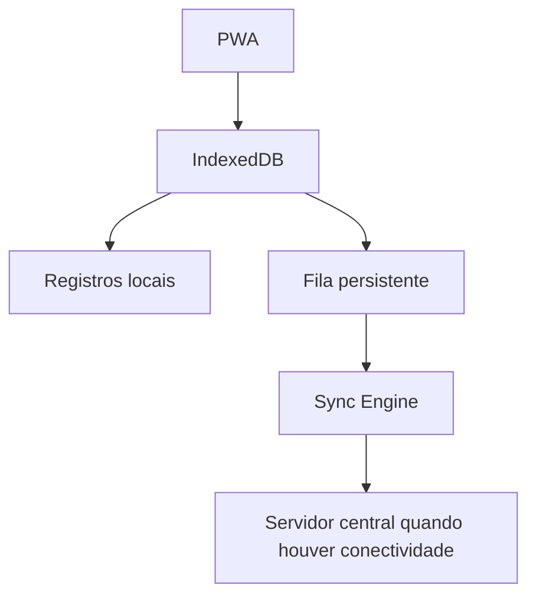
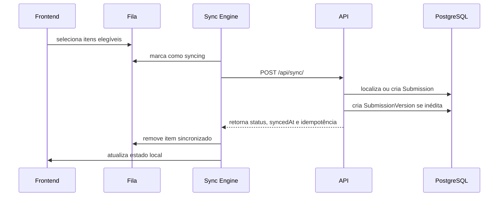
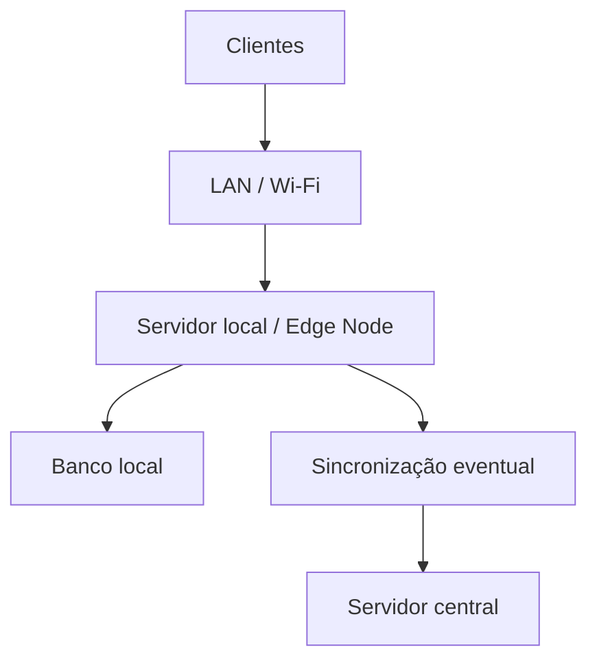
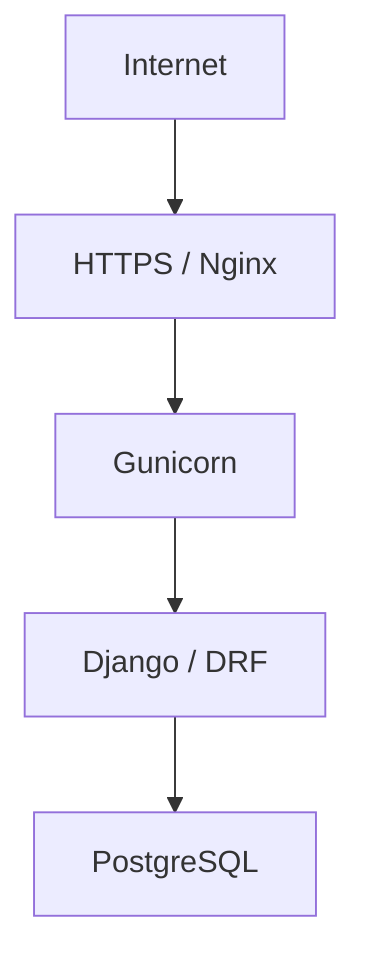

# HEMO-ANGOLA
## Plataforma de Indicadores Hemoterápicos
### Documentação Técnica da Plataforma

Versão 1.1  
Data de geração: 2026-08-12

## 1. Apresentação da plataforma

HEMO-ANGOLA nasce da necessidade de organizar a coleta e a leitura de dados hemoterápicos em um contexto no qual a disponibilidade de conectividade não pode ser tratada como premissa estável. A plataforma foi concebida para apoiar um projeto científico voltado à definição, validação e implantação de indicadores, mas o seu papel é estritamente tecnológico: dar forma operacional ao processo de coleta, armazenamento, sincronização, rastreabilidade e visualização analítica desses dados. Essa distinção é importante porque a plataforma não define, por si só, a matriz científica definitiva de indicadores, nem substitui a governança institucional necessária para o piloto.

O protótipo atualmente implementado no repositório já cobre o núcleo do fluxo operacional. Há autenticação por sessão, definição de contexto por unidade e período de referência, instrumento demonstrativo de coleta, persistência local no dispositivo, fila persistente de sincronização, replay idempotente no backend para reenvio de uma mesma submissão técnica, histórico de eventos e um dashboard analítico inicial. Ao mesmo tempo, o sistema ainda preserva o caráter de protótipo avançado: vários elementos centrais para a operação institucional do piloto continuam dependentes de validação externa, sobretudo o workflow de revisão e aceite, a governança definitiva dos indicadores e as decisões de infraestrutura associadas ao ambiente do Instituto Nacional de Sangue de Angola.

Lido a partir da arquitetura já implementada, HEMO-ANGOLA não se apresenta como um repositório de telas isoladas nem como uma coleção de endpoints. O sistema foi estruturado em torno de uma decisão arquitetural clara: separar o momento de entrada do dado do momento de transmissão ao servidor central. Essa decisão afeta a modelagem do frontend, a persistência local, o protocolo de sincronização, a organização das submissões no backend e, mais adiante, a forma como o dashboard passa a consolidar e apresentar os dados recebidos.

## 2. Concepção e requisitos do sistema

O problema tecnológico que orienta a plataforma não é apenas registrar valores numéricos. O desafio é manter um fluxo coerente de coleta em unidades com realidades operacionais possivelmente heterogêneas, permitir que o trabalho continue mesmo diante de perda de conectividade e preservar rastreabilidade suficiente para que os dados sejam posteriormente consolidados e analisados. Por isso, a arquitetura não trata o navegador como uma interface descartável diante de um backend central sempre disponível. O navegador é, no modelo atual, uma camada operacional efetiva de trabalho.

O recorte adotado pelo sistema é a combinação entre unidade e período de referência. Essa âncora organiza a criação das coletas, a recuperação de rascunhos em andamento, a leitura dos registros locais, a fila de sincronização e parte da agregação analítica posterior. A plataforma também trabalha, neste estágio, com dados agregados e com um catálogo demonstrativo de módulos, variáveis e indicadores. Isso significa que o protótipo já implementa um modo coerente de representar o fluxo técnico da coleta, mas não autoriza tratar a configuração atual como matriz metodológica definitiva validada institucionalmente.

Os requisitos mais influentes na forma da solução são visíveis no próprio código: autenticação com sessão e CSRF, coleta local resiliente à perda de conexão, fechamento explícito da coleta, sincronização posterior com segurança contra duplicação e geração de indicadores derivados a partir de dados-base. Em vez de concentrar a responsabilidade do sistema em uma única camada central, a arquitetura distribui responsabilidades entre frontend, armazenamento local, mecanismo de sincronização e backend, de forma a responder ao problema operacional que motivou o produto.

## 3. Arquitetura da plataforma

O arranjo geral da solução combina uma PWA em React/TypeScript, persistência local em IndexedDB, uma camada de sincronização no navegador, backend em Django com Django REST Framework e um banco central PostgreSQL. Na topologia de referência documentada para publicação, Nginx faz o papel de reverse proxy, Gunicorn serve a aplicação Django e o frontend compilado é entregue em regime same-origin com a API.

Figura 1 — Arquitetura geral da plataforma.

Essa topologia reflete uma decisão que atravessa todo o sistema. O frontend não depende de uma chamada contínua ao servidor para cada etapa da coleta. O backend, por sua vez, não recebe edições de campo em tempo real como premissa do produto; ele recebe uma submissão técnica estruturada quando a coleta é fechada e sincronizada. O PostgreSQL atua como persistência central dos dados recebidos, das versões de submissão e dos eventos de auditoria de servidor. Em torno desse núcleo, o sistema organiza APIs de autenticação, bootstrap, sincronização, leitura de registros técnicos, auditoria e dashboard.

Do ponto de vista da stack, a plataforma utiliza apenas tecnologias confirmadas pelo repositório e pela configuração local do projeto.

| Camada | Tecnologia | Responsabilidade |
| --- | --- | --- |
| Frontend | React 18.3.1 + TypeScript 5.5.4 | Interface, navegação, formulários e estado de interação |
| Frontend | Vite 5.4.2 | Build e ambiente de desenvolvimento |
| Frontend | Mantine 7.12.2 | Componentização visual e adaptação responsiva |
| Frontend | React Query 5.56.2 | Consumo e cache de dados remotos |
| Frontend | IndexedDB via `idb` 8.0.3 | Persistência local de registros, fila, metadados e auditoria |
| Backend | Django 4.2.24 | Modelos, autenticação, serviços e rotas |
| Backend | Django REST Framework 3.15.2 | Exposição dos endpoints REST |
| Backend | Gunicorn 23.0.0 | Servidor WSGI de referência para publicação |
| Banco central | PostgreSQL | Persistência central da aplicação |
| Infraestrutura | Nginx | Reverse proxy e entrega same-origin |

## 4. Coleta e organização dos dados

O instrumento de coleta que existe hoje no sistema é demonstrativo, mas já expressa um desenho importante da plataforma. Em vez de um formulário monolítico, o frontend organiza a entrada de dados em módulos e etapas, com revisão antes do fechamento. O catálogo atualmente carregado pelo bootstrap reúne cinco módulos, trinta e nove variáveis e três indicadores definidos no backend, todos marcados com o cuidado de não representar automaticamente a matriz final validada para Angola.

O ciclo da coleta começa de maneira explícita na tela inicial. Esse detalhe é relevante porque o sistema não cria registros implicitamente ao abrir a rota do formulário. A plataforma só passa a existir, naquela unidade e naquele período, quando o operador inicia de fato uma nova coleta. A partir desse momento, o registro é mantido no dispositivo, pode ser reaberto após reload, pode ter período e data ajustados enquanto estiver em edição e acumula histórico de alterações relevantes antes mesmo de qualquer transmissão ao servidor.

Figura 2 — Fluxo de coleta, recepção técnica e uso analítico dos dados.

O modelo de dados acompanha essa separação entre ciclo operacional e submissão técnica. No backend, entidades como `Institution`, `Unit`, `UserProfile`, `ReportingPeriod`, `CollectionModule`, `CollectionVariable`, `IndicatorDefinition`, `Submission`, `SubmissionVersion` e `AuditEvent` formam o núcleo persistido. No frontend, `LocalSubmissionRecord` e `SyncQueueItem` representam a vida operacional da coleta no dispositivo. Isso permite distinguir com clareza o trabalho local do operador do pacote técnico posteriormente enviado ao backend.

Essa distinção também explica por que o fechamento da coleta não é o mesmo evento que a sincronização. Fechar uma coleta, na implementação atual, significa mudar seu estado operacional, gerar identificadores técnicos de submissão e inserir um item em fila persistente. A transmissão ao servidor é uma etapa posterior e separada. Essa decisão reduz o acoplamento entre produção do dado e disponibilidade da infraestrutura central, mas também produz uma consequência importante: o sistema passa a carregar, no frontend, uma responsabilidade maior sobre estado, persistência e rastreabilidade.

Os registros locais refletem esse desenho. A tela de registros não lista apenas submissões recebidas pelo backend; ela representa o histórico operacional das coletas no próprio dispositivo, com estados de coleta, estados de sincronização, completude, timestamps e ações coerentes com o estágio de cada item. Essa modelagem é consistente com a ideia de que o dado nasce localmente e só depois se torna uma submissão central.

[FIGURA — Tela inicial]  
[FIGURA — Formulário de coleta]  
[FIGURA — Registros]

## 5. Indicadores e visualização analítica

O sistema foi organizado para separar dados-base de indicadores calculados. Essa decisão aparece no catálogo, no engine de validação do frontend e na camada de agregação do dashboard. O dado-base é aquilo que o operador informa no instrumento. O indicador, por sua vez, é derivado dessa base segundo uma definição conhecida. O sistema não foi concebido para tratar indicadores calculáveis como campos que devam ser digitados manualmente.

No estado atual, essa cadeia já funciona de modo verificável. Durante o preenchimento, o frontend normaliza respostas, calcula completude e deriva indicadores locais a partir do catálogo recebido pelo bootstrap. Depois, quando as submissões chegam ao backend, o dashboard recompõe leituras consolidadas a partir das versões técnicas recebidas. O resultado não é ainda um ambiente completo de analytics institucional, mas já é mais do que um conjunto estático de cards: existe uma ligação entre coleta, validação, persistência, sincronização, agregação e visualização.

Os indicadores hoje materializados no protótipo são três: percentual de doações voluntárias, taxa de inaptidão clínica e taxa de reatividade. Todos eles dependem de variáveis demonstrativas do catálogo atual e, por isso, precisam ser apresentados com cautela metodológica. O repositório documenta explicitamente que a configuração em uso não corresponde automaticamente à matriz definitiva de indicadores do INS.

| Indicador | Domínio | Variáveis utilizadas | Fórmula | Unidade | Observação |
| --- | --- | --- | --- | --- | --- |
| Percentual de doações voluntárias | Triagem clínica | `donacoes_voluntarias`, `donacoes_reposicao` | voluntárias ÷ (voluntárias + reposição) × 100 | % | Indicador demonstrativo |
| Taxa de inaptidão clínica | Triagem clínica | `candidatos_inaptos`, `candidatos_aptos` | inaptos ÷ (aptos + inaptos) × 100 | % | Indicador demonstrativo |
| Taxa de reatividade | Exames realizados | `amostras_reagentes`, `amostras_testadas` | reagentes ÷ testadas × 100 | % | Indicador demonstrativo |

No dashboard, esses indicadores são apresentados com filtros por unidade e intervalo de períodos, uma leitura sintética inicial e uma série temporal construída a partir das versões mais recentes de cada submissão. O backend reúne os dados recebidos por período, recompõe os totais absolutos e produz a métrica percentual correspondente. O frontend, então, transforma essa resposta em uma visão executiva, uma visão temporal e uma tabela consolidada. O que o dashboard oferece hoje é um primeiro recorte analítico útil para o protótipo, não um painel institucional final com cobertura temática completa.

[FIGURA — Dashboard geral]  
[FIGURA — Dashboard em dispositivo móvel]

O caminho para indicadores configuráveis aparece de forma consistente na documentação interna e na modelagem já presente no código. O sistema já possui uma base estrutural parcial para catálogo e versionamento de módulos, variáveis e indicadores, mas ainda não possui uma interface de builder administrativo nem um formula engine genérico para governar esse processo por configuração. Essa evolução continua tecnicamente desejável porque reduz a dependência de alterações manuais de código para cada novo indicador, mas ela exige governança, versionamento, validação metodológica e rastreabilidade suficientes para não comprometer a consistência histórica das análises.

## 6. Operação em cenários de conectividade limitada

O capítulo mais característico da arquitetura é o que trata de conectividade limitada. A plataforma não foi desenhada supondo comunicação permanente entre navegador e servidor central. Essa escolha não é uma camada cosmética de offline colocada sobre um sistema originalmente online. Ela orienta o produto desde a criação do registro local até a forma como a submissão técnica chega ao backend.

O IndexedDB ocupa, nesse desenho, um papel estrutural. Ele não armazena apenas um cache passageiro da interface; armazena registros de coleta, itens da fila de sincronização, metadados como a última sincronização e também eventos de auditoria locais. Quando o operador preenche uma coleta, o trabalho fica preservado no próprio dispositivo. Se a aplicação for recarregada, o registro pode ser retomado. Se a coleta for fechada, ela passa a coexistir com um item de fila sem exigir que o backend esteja disponível naquele instante.

Figura 3 — Arquitetura local-first por dispositivo.

O Sync Engine completa essa decisão arquitetural. Ele recupera sincronizações interrompidas, identifica itens elegíveis, altera seu estado para envio em andamento, monta o lote a ser transmitido e trata falhas com retry e backoff. O backend recebe esse lote por meio do endpoint de sincronização, procura ou cria a submissão correspondente por UUID e só persiste uma nova versão quando se trata de fato de uma submissão ainda não registrada para aquela combinação lógica de submissão e versão. A consequência direta disso é a idempotência técnica de replay: o reenvio do mesmo pacote não deve produzir duplicação técnica no servidor, embora isso não resolva, por si só, conflitos semânticos de concorrência.

Figura 4 — Sequência simplificada de sincronização.

No cenário sem internet, o comportamento que o código realmente sustenta é o seguinte: a coleta continua utilizável no dispositivo, os dados permanecem preservados localmente, coletas fechadas ficam em fila e, quando a conectividade retorna, a sincronização pode ser retomada manualmente. O backend processa o lote com segurança contra duplicação e o estado local é então atualizado para refletir o recebimento técnico.

Esse modelo, contudo, tem uma limitação clara que precisa aparecer sem ambiguidade. A operação offline atual é por dispositivo. O fato de dois computadores usarem a aplicação sem internet não faz com que eles compartilhem automaticamente o mesmo estado de forma imediata. Cada navegador mantém sua própria base local. Em uma indisponibilidade prolongada da conexão externa, isso não se converte automaticamente em um ambiente multiusuário compartilhado.

É nesse ponto que surge a alternativa de uma arquitetura edge. Um nó local em rede, com banco próprio e sincronização posterior com o servidor central, poderia responder melhor a cenários em que uma unidade inteira precisa continuar trabalhando com vários dispositivos ao mesmo tempo sem acesso à internet. Essa alternativa, entretanto, não está implementada e depende diretamente do diagnóstico da infraestrutura do INS, da conectividade real das unidades, da rede local disponível e do custo operacional aceitável para o piloto.

Figura 5 — Alternativa arquitetural para operação multiusuário com edge node.

## 7. Segurança, controle de acesso e rastreabilidade

O sistema adota autenticação por sessão Django, com proteção CSRF integrada ao fluxo do frontend. No cliente, o `httpClient` lê o cookie `csrftoken`, adiciona o cabeçalho correspondente quando necessário e envia requisições com `credentials: include`, o que mantém coerência com o modelo same-origin documentado para publicação. No backend, há configuração por ambiente para `ALLOWED_HOSTS`, origens confiáveis, cookies seguros, `SECURE_SSL_REDIRECT`, `SECURE_PROXY_SSL_HEADER` e HSTS, o que forma uma base de endurecimento adequada ao estágio atual da solução.

O controle de acesso é mais limitado do que a modelagem de perfis pode sugerir à primeira vista. O backend define papéis como operador, revisor, gestor, administrador funcional e pesquisador, mas o RBAC implementado ainda é parcial. A evidência mais clara dessa restrição por papel aparece na auditoria central, cujo acesso é limitado a perfis de gestão e administração. Isso basta para mostrar que o sistema já possui uma primeira camada de diferenciação de acesso, mas não autoriza descrever um modelo institucional completo de autorização já plenamente consolidado.

Também merece atenção a trilha de auditoria. No servidor, eventos de autenticação, sincronização e visualização do dashboard são registrados com identificação do ator, entidade, correlação e timestamps. No cliente, cada coleta mantém um histórico local de eventos, incluindo criação, atualização, fechamento, reabertura e resultados de sincronização. A presença dessa dupla camada de rastreabilidade é coerente com a arquitetura local-first: parte da história do dado acontece antes mesmo de o backend receber a submissão.

O que ainda não está completo, desse ponto de vista, é o encadeamento institucional posterior. A modelagem já prevê estados e estruturas associados a revisão, aceite, devolução e conflito, mas o protótipo ainda não implementa esse fluxo de ponta a ponta. A segurança e a rastreabilidade do que já existe podem ser descritas com firmeza; a governança institucional completa ainda não.

## 8. Infraestrutura e implantação

O backend foi preparado para operar com PostgreSQL como banco central, Django como aplicação principal e Gunicorn como servidor WSGI de referência. O frontend, quando compilado, pode ser servido pelo mesmo domínio de publicação, com Nginx assumindo tanto a entrega do build estático quanto o encaminhamento das chamadas `/api/` para a aplicação Django. Essa topologia reduz complicações de origem cruzada e se alinha ao modelo de autenticação por sessão adotado pelo sistema.

Figura 6 — Topologia de referência para implantação.

O repositório contém dois planos distintos de execução. O primeiro é o ambiente de desenvolvimento, com `docker-compose.yml` trazendo PostgreSQL, backend em modo de desenvolvimento e frontend em servidor Vite. O segundo é um baseline de produção documentado por `docker-compose.prod.yml`, pelos exemplos de Nginx e systemd e pela documentação em `docs/deployment/`. Isso é suficiente para afirmar que a plataforma possui uma arquitetura de implantação de referência. Não é suficiente, por si só, para declarar a existência de um ambiente definitivo do INS já validado em operação real.

Healthcheck e recuperação também fazem parte desse conjunto. O endpoint `/api/health/` executa uma verificação mínima de aplicação e banco e é utilizado pelos healthchecks dos arquivos de compose. A documentação de backup e restore descreve um procedimento manual com `pg_dump` e `pg_restore`, incluindo a recomendação de testar restauração em banco temporário. O que existe hoje é uma base operacional documentada; a validação rotineira dessa operação no contexto do piloto ainda permanece como etapa a cumprir.

## 9. Estado atual de desenvolvimento

O sistema já consolidou o núcleo técnico do fluxo local-first. Isso inclui autenticação por sessão, bootstrap de contexto, criação explícita de coletas, persistência local, retomada após reload, fechamento controlado, fila persistente, sincronização manual, retry com backoff, recebimento técnico idempotente, registros locais e dashboard MVP. Esses componentes formam um conjunto coerente e testado o suficiente para sustentar demonstração técnica, análise arquitetural e discussão sobre o piloto.

Há, entretanto, áreas que ainda permanecem em estágio intermediário. O RBAC é parcial, a governança do catálogo de indicadores continua dependente da evolução para um modelo mais configurável e o dashboard ainda representa um primeiro recorte analítico, concentrado em três indicadores demonstrativos. Mesmo onde a modelagem de dados já sugere caminhos futuros, como aceite institucional, devolução e conflito, o fluxo correspondente ainda não foi fechado no produto.

A principal limitação técnica do protótipo não está no mecanismo local-first em si, mas naquilo que acontece depois do recebimento técnico central. O sistema já sabe preservar o dado, transmiti-lo e evitar duplicação. O que ainda precisa amadurecer é a governança institucional desse dado: quem revisa, quem aceita, o que acontece diante de inconsistências concorrentes, como uma nova definição de indicador afeta o histórico e como o ambiente do piloto será efetivamente organizado com base nas condições reais do INS.

## 10. Evoluções previstas e preparação para o piloto

As próximas evoluções naturais do sistema se distribuem em dois eixos. O primeiro é arquitetural e diz respeito à ampliação da configurabilidade: indicator builder, formula engine seguro, versionamento metodológico mais explícito e possibilidade de formular partes do instrumento com maior apoio em configuração. O segundo é operacional e diz respeito ao piloto: resolução de conflitos, governança de aceite, observabilidade mais madura, validação de backup e restore, e eventual decisão sobre a necessidade de edge node em unidades com conectividade externa muito restrita.

O indicator builder aparece, nesse cenário, como um desdobramento lógico da modelagem já existente de módulos, variáveis e indicadores. O ganho esperado não é meramente comodidade administrativa. Trata-se de reduzir a dependência de alterações manuais de código para evoluções metodológicas, desde que isso venha acompanhado de governança, versionamento, validação e rastreabilidade suficientes para proteger a integridade histórica do sistema. Sem essas camadas, a flexibilização passaria a introduzir risco analítico em vez de reduzi-lo.

A preparação para o piloto depende também de decisões que não podem ser inferidas apenas pelo código. O diagnóstico da infraestrutura do INS, da conectividade das unidades, da quantidade de usuários, dos equipamentos disponíveis, da governança local e da matriz final de indicadores continua sendo parte do trabalho que antecede qualquer operação institucional controlada. A documentação técnica pode explicitar essas dependências e organizar o raciocínio sobre elas, mas não substitui a validação institucional necessária.

## 11. Matriz de maturidade

| Componente | Estado | Evidência principal | Próximo passo dominante |
| --- | --- | --- | --- |
| Backend Django/DRF | Implementado | apps, endpoints e testes | ampliar workflow institucional |
| Frontend React/PWA | Implementado | rotas, telas, serviços e testes | ampliar cobertura de cenários do piloto |
| PostgreSQL | Implementado | settings, compose e docs de deploy | validar operação de referência no piloto |
| Persistência local com IndexedDB | Implementado | `indexedDb.ts` e repositórios locais | manter coerência entre dispositivos e governança |
| Coleta local | Implementado | collection service, formulário e E2E | consolidar regras institucionais de uso |
| Sincronização com fila persistente | Implementado | Sync Engine e endpoint `/api/sync/` | ampliar tratamento de casos institucionais |
| Retry e backoff | Implementado | lógica de falha e reenvio | definir política operacional em falhas persistentes |
| Idempotência | Implementado | `SyncBatchView` e teste backend | estender a cenários de conflito semântico |
| Dashboard | Parcial | backend e frontend do dashboard | ampliar escopo analítico e governança |
| Indicadores demonstrativos | Parcial | catálogo, dashboard e seed demo | validar matriz institucional final |
| RBAC | Parcial | perfis e restrição de auditoria | definir política completa por papel |
| Auditoria e rastreabilidade | Parcial | `AuditEvent` e `eventHistory` | expandir o fluxo institucional posterior |
| Backup e restore | Parcial | documentação operacional | validar restore em rotina controlada |
| Resolução de conflitos | Gap | modelagem parcial sem fluxo completo | definir política e implementar workflow |
| Indicator Builder | Proposto | baseline arquitetural interna | modelar e governar publicação |
| Formula Engine | Proposto | baseline arquitetural interna | definir parser, validação e execução segura |
| Formulários configuráveis | Proposto | direção arquitetural documentada | avaliar custo/benefício e impacto de governança |
| Edge node local | Proposto / depende do INS | análise arquitetural offline | decidir após diagnóstico institucional |

## 12. Considerações técnicas

O elemento mais consistente da plataforma, neste estágio, é a decisão de desacoplar a produção do dado da sua transmissão ao servidor central. A combinação entre PWA, IndexedDB, fila persistente, Sync Engine e recebimento idempotente define o centro da arquitetura e organiza grande parte das escolhas de implementação vistas no repositório. É essa decisão que permite à plataforma operar como sistema de coleta por dispositivo mesmo em cenários de conectividade limitada.

Os principais limites aparecem onde a arquitetura deixa de ser apenas técnica e passa a exigir governança operacional e institucional. O protótipo ainda não conclui o fluxo de revisão, aceite e conflito; o catálogo de indicadores continua demonstrativo; a estratégia de operação compartilhada em indisponibilidade prolongada de internet ainda precisa ser validada; e a preparação efetiva para o piloto depende de condições do INS que o código não pode antecipar. A documentação de apresentação deve, portanto, mostrar um sistema já capaz de sustentar seu núcleo técnico, mas ainda em fase de consolidação para o ambiente institucional ao qual se destina.
