# HEMO-ANGOLA

Plataforma de Indicadores Hemoterápicos

## DOCUMENTAÇÃO TÉCNICA DA PLATAFORMA

Versão 1.1  
Data de geração: 2026-08-12

## Resumo executivo

HEMO-ANGOLA é uma plataforma tecnológica voltada à coleta estruturada de dados hemoterápicos agregados, com persistência local no dispositivo, sincronização posterior com um backend central e visualização analítica inicial por dashboard. No estado atual do repositório, o produto já implementa autenticação por sessão, definição de contexto por unidade e período de referência, instrumento demonstrativo de coleta em múltiplas etapas, armazenamento local com IndexedDB, fila persistente de sincronização, reenvio com retry/backoff, recebimento técnico idempotente no servidor, trilha de auditoria mínima e um dashboard MVP com três indicadores calculados a partir de dados-base.

Do ponto de vista arquitetural, a solução está organizada em uma PWA React/TypeScript no frontend, uma camada local de persistência e sincronização no navegador, um backend Django com Django REST Framework e um banco central PostgreSQL. A topologia de referência documentada para publicação utiliza Nginx como reverse proxy, Gunicorn como servidor de aplicação e Django/DRF como camada de API. Esse arranjo atende ao objetivo de permitir operação resiliente à conectividade em nível de dispositivo: a coleta pode continuar, ser salva e fechada localmente mesmo na ausência de internet, permanecendo em fila até a disponibilidade de conexão externa.

O protótipo atual já vai além de uma prova conceitual puramente documental. Há evidências em código, migrations e testes para o fluxo local-first, para a recuperação de estado após reload, para a idempotência da sincronização e para a geração de leituras analíticas iniciais no dashboard. Ao mesmo tempo, a auditoria do repositório mostra que componentes importantes para o piloto institucional ainda permanecem incompletos ou dependentes de validação externa, especialmente o workflow de revisão e aceite institucional, a resolução explícita de conflitos, a governança definitiva dos indicadores, a estratégia de operação multiusuário durante indisponibilidade prolongada de internet e a definição operacional final junto ao Instituto Nacional de Sangue de Angola (INS).

Assim, a plataforma deve ser compreendida, em agosto de 2026, como um protótipo funcional avançado com base arquitetural coerente, pronto para demonstração técnica e para consolidação de gaps críticos, mas ainda não equivalente a um produto piloto institucional plenamente governado.

## 1. Contexto e objetivo

HEMO-ANGOLA articula dois planos distintos que não devem ser confundidos.

### 1.1 Projeto científico

O projeto científico define o problema de pesquisa, a metodologia de validação, a seleção e priorização de indicadores hemoterápicos e os critérios institucionais do piloto. A documentação histórica v1.0 e os documentos arquiteturais atuais deixam explícito que a matriz definitiva de indicadores, as regras finais de revisão institucional e parte das decisões de governança dependem de validação científica e institucional, especialmente do INS.

### 1.2 Plataforma tecnológica

A plataforma tecnológica operacionaliza:

- autenticação e controle de sessão;
- definição de contexto por unidade e período;
- preenchimento de instrumento demonstrativo de coleta;
- persistência local dos dados;
- validação mínima e cálculo derivado local;
- fechamento da coleta;
- sincronização posterior;
- recebimento técnico central;
- rastreabilidade por eventos;
- consolidação analítica inicial em dashboard.

Em outras palavras, o projeto científico define o que deve ser medido e validado; a plataforma tecnológica implementa como os dados são coletados, preservados, transmitidos e visualizados.

## 2. Escopo atual do sistema

### 2.1 AS-IS identificado no repositório

O estado atual do sistema, auditado a partir de código, testes, migrations e documentação técnica, inclui:

- `IMPLEMENTADO`: autenticação por sessão Django com fluxo de login, logout, CSRF e verificação de sessão.
- `IMPLEMENTADO`: contexto demonstrativo por instituição, unidade e período de referência.
- `IMPLEMENTADO`: catálogo demonstrativo de módulos, variáveis e indicadores enviado pelo backend.
- `IMPLEMENTADO`: início explícito de coleta, preenchimento em etapas, salvamento local, validação, fechamento e listagem de registros.
- `IMPLEMENTADO`: IndexedDB para persistência local de registros, fila de sincronização, metadados e eventos de auditoria locais.
- `IMPLEMENTADO`: sincronização manual de coletas fechadas com reenvio seguro e idempotência no backend.
- `IMPLEMENTADO`: dashboard analítico MVP com filtros, três KPIs e série temporal por período.
- `IMPLEMENTADO`: trilha mínima de auditoria no servidor e histórico de eventos no cliente.
- `IMPLEMENTADO PARTIALLY`: perfis e restrições de acesso por papel.
- `IMPLEMENTADO PARTIALLY`: baseline de deploy e operação para ambiente de referência com Nginx, Gunicorn e PostgreSQL.

### 2.2 TO-BE, proposto ou incompleto

- `TO-BE / DEPENDE DO INS`: workflow institucional completo de revisão, devolução, aceite e consolidação.
- `GAP`: resolução end-to-end de conflitos de sincronização.
- `IMPLEMENTADO PARTIALLY`: governança de indicadores; o catálogo existe, mas o builder administrativo ainda não.
- `PROPOSTO`: formula engine genérico e seguro para indicadores configuráveis.
- `PROPOSTO / DEPENDE DO DIAGNÓSTICO DO INS`: arquitetura com edge node local para operação multiusuário em indisponibilidade prolongada da internet.

## 3. Visão funcional da plataforma

O fluxo funcional principal encontrado no código pode ser resumido da seguinte forma:

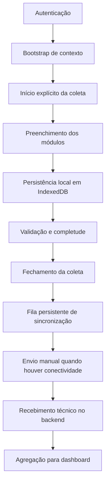

Figura 1 — Arquitetura funcional geral.

Na implementação atual, a coleta não nasce implicitamente ao abrir a tela do formulário. Ela é criada por ação explícita do operador na tela inicial. A partir daí, as respostas são gravadas localmente e podem ser retomadas após reload ou reabertura do navegador no mesmo dispositivo.

## 4. Arquitetura da solução

### 4.1 Visão de contêineres

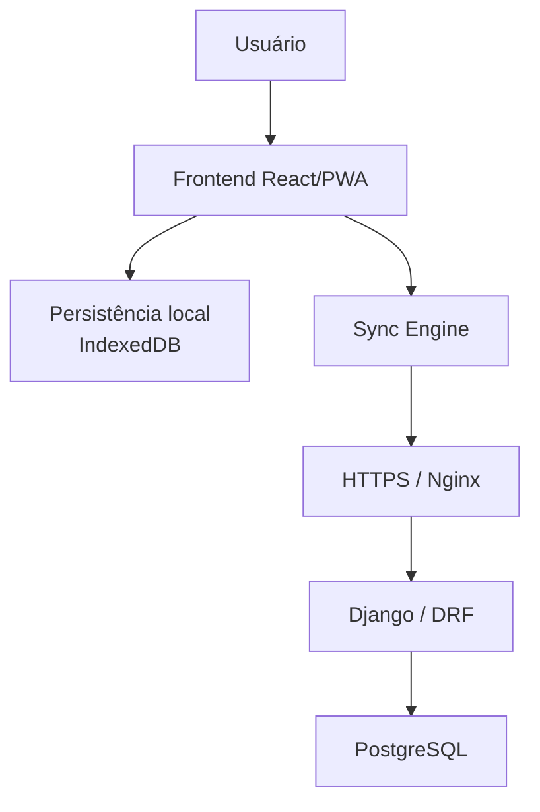

Figura 2 — Arquitetura da solução.

### 4.2 Componentes principais

#### Frontend React/PWA

O frontend é construído com React, TypeScript, Vite e biblioteca de componentes Mantine. A presença de `vite-plugin-pwa`, dos ícones `pwa-192.png` e `pwa-512.png`, e da inicialização local do banco IndexedDB sustenta a caracterização da interface como PWA.

#### Persistência local com IndexedDB

O frontend mantém quatro áreas persistidas no navegador:

- registros de coleta;
- fila de sincronização;
- metadados, como a data da última sincronização;
- eventos de auditoria locais.

#### Sync Engine

Há uma camada explícita para orquestração de sincronização, responsável por:

- recuperar sincronizações interrompidas;
- descobrir itens elegíveis na fila;
- marcar itens em sincronização;
- enviar lotes ao backend;
- tratar erro com backoff;
- marcar recebimento técnico no sucesso.

#### Backend Django / DRF

O backend fornece endpoints de autenticação, bootstrap, sincronização, leitura de registros centralizados, auditoria e dashboard. A autenticação padrão do repositório é baseada em sessão Django.

#### Banco central PostgreSQL

Fora dos testes em SQLite, a base central de persistência é PostgreSQL. O backend também documenta e referencia um baseline de restore e backup para essa base.

#### Gunicorn e Nginx

O repositório possui baseline de produção com Gunicorn para servir o Django e Nginx como reverse proxy de referência, inclusive nos exemplos de `docker-compose.prod.yml` e `deploy/nginx/`.

## 5. Stack tecnológica

| Camada | Tecnologia | Responsabilidade | Estado |
| --- | --- | --- | --- |
| Frontend | React 18.3.1 | Interface do usuário e navegação | IMPLEMENTADO |
| Frontend | TypeScript 5.5.4 | Tipagem estática da aplicação cliente | IMPLEMENTADO |
| Frontend | Vite 5.4.2 | Build e dev server do frontend | IMPLEMENTADO |
| Frontend | Mantine 7.12.2 | Componentização visual responsiva | IMPLEMENTADO |
| Frontend | React Query 5.56.2 | Consumo e cache de dados remotos | IMPLEMENTADO |
| Frontend | IndexedDB via `idb` 8.0.3 | Persistência local resiliente | IMPLEMENTADO |
| Frontend | Playwright 1.46.1 | Testes E2E do fluxo crítico | IMPLEMENTADO |
| Frontend | Vitest 2.0.5 | Testes unitários e de integração do frontend | IMPLEMENTADO |
| Backend | Django 4.2.24 | Aplicação web e modelos centrais | IMPLEMENTADO |
| Backend | Django REST Framework 3.15.2 | Endpoints REST | IMPLEMENTADO |
| Backend | django-cors-headers 4.4.0 | Controle de origem entre frontend e backend | IMPLEMENTADO |
| Backend | Gunicorn 23.0.0 | Servidor WSGI para produção de referência | IMPLEMENTADO |
| Banco central | PostgreSQL 16-alpine no baseline compose | Persistência central do sistema | IMPLEMENTADO |
| Infraestrutura | Nginx 1.27-alpine no baseline compose | Reverse proxy e entrega same-origin | IMPLEMENTADO |

## 6. Modelo de dados e domínio

### 6.1 Entidades centrais

As principais entidades persistidas no backend são:

- `Institution`
- `Unit`
- `UserProfile`
- `ReportingPeriod`
- `CollectionModule`
- `CollectionVariable`
- `IndicatorDefinition`
- `Submission`
- `SubmissionVersion`
- `AuditEvent`
- `AcceptedData`

No frontend, o ciclo operacional local é representado principalmente por:

- `LocalSubmissionRecord`
- `SyncQueueItem`
- `RecordEvent`
- `ValidationSummary`

### 6.2 Relações conceituais

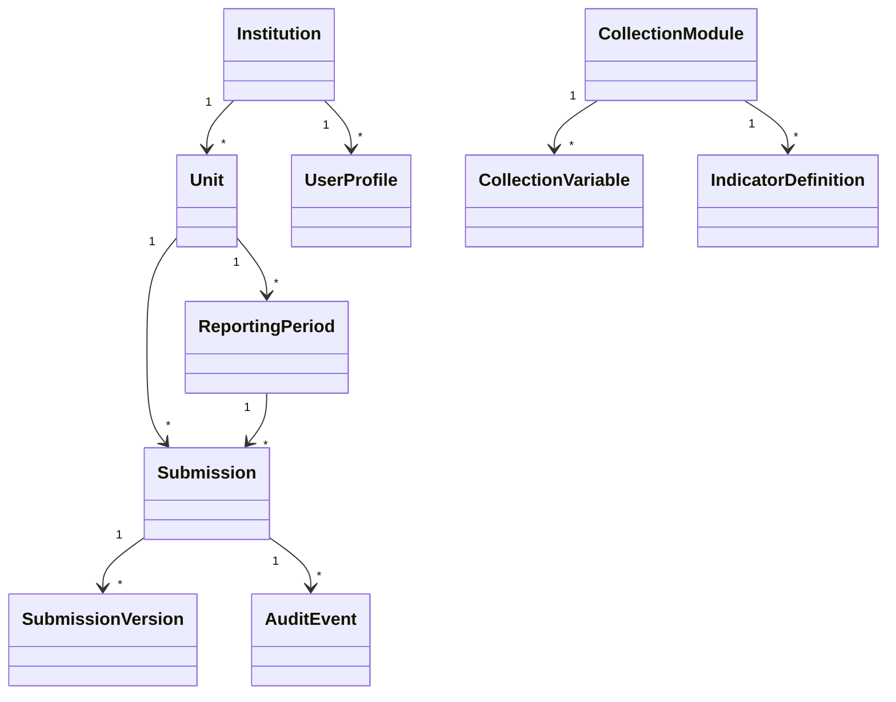

Figura 3 — Modelo conceitual simplificado do domínio.

### 6.3 Distinção importante: coleta versus submissão

No repositório atual, há separação entre:

- ciclo operacional local de coleta, mantido no navegador;
- submissão técnica central, persistida como `Submission` e `SubmissionVersion`.

Essa distinção é central para a arquitetura local-first: o trabalho do operador nasce e evolui localmente, enquanto o backend recebe um pacote técnico versionado quando a sincronização ocorre.

## 7. Coleta de dados

### 7.1 Estrutura do instrumento

O backend demonstra um catálogo com:

- 5 módulos;
- 39 variáveis;
- 3 indicadores definidos;

todos marcados como dados demonstrativos, candidatos ou ainda dependentes de validação institucional.

Os módulos demonstrativos atuais são:

1. Triagem clínica
2. Coleta
3. Exames realizados
4. Produção hemoterápica
5. Transfusão / distribuição

### 7.2 Fluxo de coleta

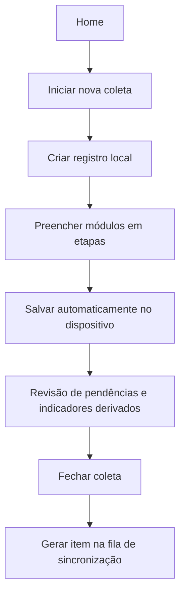

Figura 4 — Fluxo de coleta.

### 7.3 Características implementadas

- início explícito da coleta;
- associação a unidade e período de referência;
- possibilidade de alterar período e data da coleta enquanto o registro permanece editável;
- preenchimento por etapas com revisão final;
- cálculo de completude por módulo e completude geral;
- salvamento local automático;
- fechamento apenas quando a validação mínima é satisfeita;
- reabertura controlada de coleta fechada e ainda não sincronizada.

### 7.4 Estados operacionais

No frontend, os estados de coleta declarados são:

- `in_progress`
- `ready_for_review`
- `closed`
- `received`
- `accepted`
- `rejected`

Entretanto, a auditoria do código mostra que `ready_for_review`, `accepted` e `rejected` existem no modelo de tipos, mas não compõem ainda um workflow institucional completo na prática do protótipo. Por isso, devem ser lidos como suporte estrutural parcial, e não como evidência de fluxo implementado de ponta a ponta.

## 8. Dados-base e indicadores

### 8.1 Separação conceitual

O sistema distingue conceitualmente dado-base e indicador calculado.

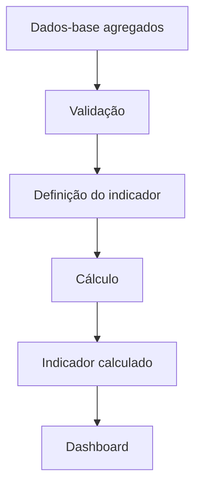

Figura 5 — Relação entre dados-base e indicadores.

No estado atual, essa separação aparece de duas maneiras:

- localmente, no frontend, durante o cálculo de indicadores derivados na validação;
- centralmente, no dashboard, a partir da agregação das versões recebidas.

### 8.2 Regra arquitetural

Quando um indicador for calculável a partir dos dados-base, ele não deve ser digitado manualmente. Essa diretriz está alinhada tanto com a modelagem atual quanto com a documentação de evolução arquitetural do repositório.

## 9. Indicadores atuais do protótipo

Os indicadores hoje efetivamente presentes na definição demonstrativa e no dashboard são:

| Indicador | Domínio | Variáveis utilizadas | Fórmula | Unidade | Estado | Observação |
| --- | --- | --- | --- | --- | --- | --- |
| Percentual de doações voluntárias | Triagem clínica | `donacoes_voluntarias`, `donacoes_reposicao` | doações voluntárias ÷ (doações voluntárias + doações de reposição) × 100 | % | IMPLEMENTADO PARTIALLY | Indicador demonstrativo, não validado como matriz oficial do INS |
| Taxa de inaptidão clínica | Triagem clínica | `candidatos_inaptos`, `candidatos_aptos` | candidatos inaptos ÷ (candidatos aptos + candidatos inaptos) × 100 | % | IMPLEMENTADO PARTIALLY | Indicador demonstrativo |
| Taxa de reatividade | Exames realizados | `amostras_reagentes`, `amostras_testadas` | amostras reagentes ÷ amostras testadas × 100 | % | IMPLEMENTADO PARTIALLY | Indicador demonstrativo |

Classificação do conjunto atual:

- `DEMONSTRATIVO`: o próprio backend explicita que a configuração atual não representa a matriz final validada para Angola.
- `CANDIDATO`: parte das variáveis auxiliares do catálogo é documentada como candidata ou dependente de validação.
- `VALIDADO`: não há evidência suficiente no repositório para classificar esses indicadores como oficialmente validados pelo INS.

## 10. Dashboard

### 10.1 Escopo real implementado

O dashboard implementado no repositório não deve ser descrito como analytics completo institucional. O que existe hoje é um dashboard MVP com:

- três cards de KPI principais;
- filtros por unidade e intervalo de período;
- visão executiva;
- série temporal;
- tabela consolidada por período;
- rastreabilidade por `trace_records` na API.

### 10.2 KPIs e filtros

Os KPIs atuais são:

- percentual de doações voluntárias;
- taxa de inaptidão clínica;
- taxa de reatividade laboratorial.

Os filtros efetivamente suportados são:

- unidade;
- período inicial;
- período final.

### 10.3 O que não deve ser afirmado como existente

Não há evidência suficiente, no estado atual do código, para afirmar que o dashboard já implementa:

- views especializadas por perdas;
- drill-down institucional completo;
- governança analítica avançada;
- painel definitivo de produção nacional;
- múltiplos grupos oficiais de indicadores aprovados.

### 10.4 Placeholder de captura

[FIGURA — Dashboard geral]  
[FIGURA — Dashboard em dispositivo móvel]

Figura 6 — Placeholders para capturas reais do dashboard.

## 11. Responsividade

Há evidências de preocupação responsiva no frontend:

- uso de `SimpleGrid`, `hiddenFrom`, `visibleFrom` e media queries;
- layouts alternativos de dashboard e listas para telas menores;
- relatório existente sobre múltiplas coletas em dispositivo móvel.

Assim, é tecnicamente correto afirmar:

- `IMPLEMENTADO PARTIALLY`: suporte responsivo a desktop, tablet e smartphone no protótipo.

Não é tecnicamente correto afirmar:

- compatibilidade universal com qualquer dispositivo;
- validação extensiva em parque heterogêneo de hardware real do INS.

### 11.1 Adaptações observadas

- dashboard com comportamento adaptado por media query;
- listas de registros e sincronização com variantes para telas menores;
- coleta organizada em etapas e componentes adequados ao uso móvel.

## 12. Arquitetura local-first

Esta é uma das decisões centrais do sistema atual.

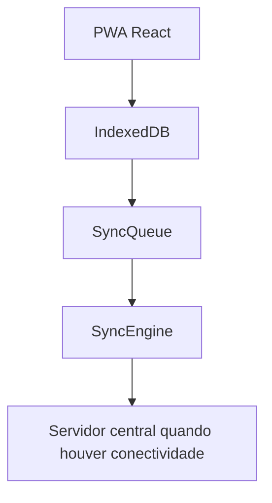

Figura 7 — Arquitetura local-first.

### 12.1 O que está implementado

- persistência local de registros;
- sobrevivência a reload e reabertura do navegador no mesmo dispositivo;
- fila persistente de envio;
- sincronização posterior manual;
- retry com backoff;
- idempotência no backend para evitar duplicação;
- recuperação de sincronizações interrompidas.

### 12.2 O que essa arquitetura resolve

A arquitetura atual reduz dependência de conectividade contínua durante o preenchimento e o fechamento da coleta. O operador pode continuar utilizando as capacidades locais do sistema mesmo sem internet, e o envio técnico fica desacoplado do momento de entrada dos dados.

## 13. Cenário sem internet

O comportamento verificável do protótipo pode ser descrito da seguinte forma:

1. A conexão externa é perdida.
2. A aplicação continua utilizando a persistência local disponível no navegador.
3. Os dados da coleta permanecem preservados em IndexedDB.
4. Coletas fechadas permanecem em fila para sincronização posterior.
5. Quando a conectividade retorna, o usuário pode iniciar a sincronização manual.
6. O Sync Engine monta o lote elegível e envia ao backend.
7. O backend processa o recebimento de forma idempotente.
8. O estado local é atualizado para refletir o recebimento técnico.

### 13.1 Fluxo offline simplificado

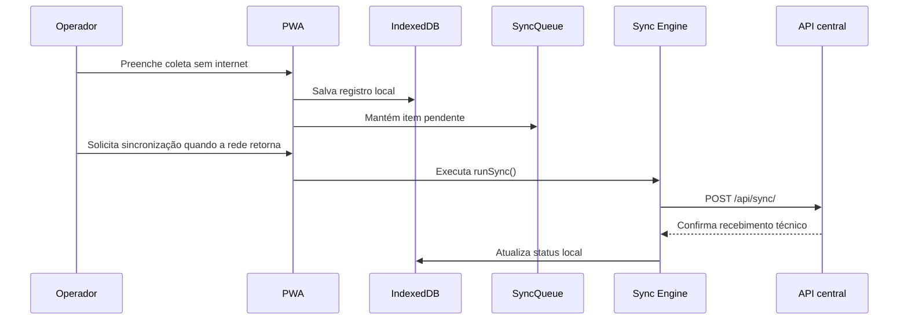

Figura 8 — Sequência simplificada de operação offline e sincronização posterior.

## 14. Limitação do offline atual

É importante registrar explicitamente que a solução atual opera em modo offline por dispositivo, e não como operação multiusuário compartilhada sem internet.

Exemplo conceitual:

- PC A -> IndexedDB A
- PC B -> IndexedDB B

Sem um servidor compartilhado acessível, os dois dispositivos não passam a compartilhar imediatamente o mesmo estado local. Portanto:

- `IMPLEMENTADO`: offline por dispositivo.
- `GAP`: operação compartilhada multiusuário offline.

## 15. Alternativa local edge

### 15.1 Caráter da proposta

Uma arquitetura alternativa para indisponibilidade prolongada de internet em operação multiusuário aparece como evolução possível, mas não implementada.

Status:

- `PROPOSTO`
- `DEPENDE DO DIAGNÓSTICO DO INS`

### 15.2 Diagrama conceitual

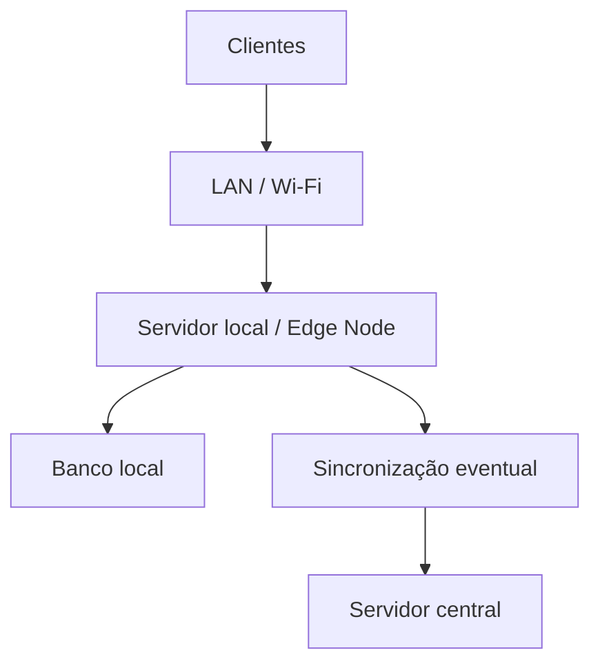

Figura 9 — Alternativa edge para operação multiusuário.

### 15.3 Vantagens e custos

Possíveis vantagens:

- melhor compartilhamento local durante indisponibilidade prolongada;
- menor isolamento de estado entre dispositivos;
- possibilidade de operação mais coordenada em uma mesma unidade.

Custos arquiteturais:

- maior complexidade operacional;
- necessidade de hardening do nó local;
- estratégia adicional de backup e sincronização;
- maior superfície de segurança e suporte.

## 16. Sincronização

### 16.1 Elementos técnicos implementados

- UUID para submissão e versão;
- fila persistente;
- estados de sincronização;
- retry com backoff;
- idempotência;
- acknowledgement em resposta do endpoint;
- atualização do estado local após sucesso.

### 16.2 Fluxo técnico

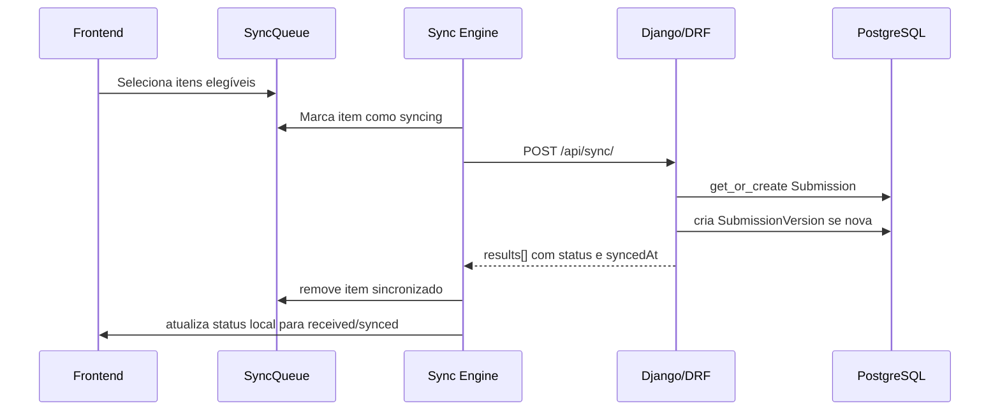

Figura 10 — Sequência simplificada de sincronização.

### 16.3 Estados de sincronização

No cliente:

- `local_only`
- `pending`
- `syncing`
- `synced`
- `error`
- `conflict`

Na fila:

- `queued`
- `syncing`
- `failed`
- `synced`

No backend, o caminho efetivamente exercitado pelos testes culmina em `received` como recebimento técnico.

## 17. Conflitos

O estado atual da resolução de conflitos deve ser descrito com cautela:

- `GAP`: não há fluxo end-to-end implementado de detecção e resolução de conflitos.
- há suporte estrutural parcial em modelos e tipos para estados de conflito;
- não há evidência de política completa com `409 Conflict`, comparação otimista de versão ou resolução manual integrada ao produto.

Portanto, concorrência otimista, version check formal e workflow dedicado de conflito devem ser tratados como evolução planejada, não como implementação atual.

## 18. Segurança

### 18.1 Controles identificados

- autenticação por sessão Django;
- proteção CSRF com cookie e cabeçalho;
- leitura de segredos e parâmetros por ambiente;
- suporte configurável a cookies seguros;
- suporte configurável a SSL redirect e HSTS;
- política de `ALLOWED_HOSTS`;
- uso de `credentials: include` no cliente;
- trilha mínima de auditoria;
- baseline same-origin para produção de referência.

### 18.2 Autorização e RBAC

O repositório define papéis em `UserProfile`:

- operador;
- revisor;
- gestor;
- administrador funcional;
- pesquisador.

Entretanto, o RBAC atual é parcial. Há evidência concreta de restrição de acesso à auditoria central para perfis `admin` e `manager`, mas não de uma política institucional plenamente implementada para todo o sistema.

Classificação:

- `IMPLEMENTADO PARTIALLY`: RBAC.

### 18.3 HTTPS e headers

O backend possui suporte configurável para:

- `SECURE_PROXY_SSL_HEADER`
- `SECURE_SSL_REDIRECT`
- `SECURE_HSTS_SECONDS`
- `SECURE_HSTS_INCLUDE_SUBDOMAINS`
- `SECURE_HSTS_PRELOAD`
- cookies seguros

O que o repositório comprova é a existência do baseline de hardening. O que ele não comprova, por si só, é a validação operacional de um ambiente público específico já em uso.

## 19. Perfis de acesso

| Papel | Responsabilidades observáveis | Permissões relevantes no protótipo | Estado |
| --- | --- | --- | --- |
| Operador | iniciar, preencher, salvar, fechar e sincronizar coletas | fluxo operacional principal | IMPLEMENTADO |
| Revisor | papel previsto na modelagem | sem workflow institucional completo observado | IMPLEMENTADO PARTIALLY |
| Gestor | leitura analítica e acesso administrativo restrito, como auditoria | acesso ao dashboard e auditoria central no baseline atual | IMPLEMENTADO PARTIALLY |
| Administrador funcional | sustentação funcional e dados demonstrativos | Django Admin e acesso ampliado no baseline demo | IMPLEMENTADO PARTIALLY |
| Pesquisador | papel cadastrado na modelagem | sem fluxo diferenciado claramente implementado | IMPLEMENTADO PARTIALLY |

## 20. Auditoria e rastreabilidade

### 20.1 Mecanismos implementados

No servidor:

- `AuditEvent` com identificação do ator, timestamps, entidade, correlação, origem e metadados.

No cliente:

- `eventHistory` por registro local;
- eventos de criação, atualização, fechamento, reabertura, início de sync, sucesso e falha.

### 20.2 O que isso permite hoje

- associar eventos a usuário e papel quando disponíveis;
- reconstruir a sequência principal de alterações de uma coleta no dispositivo;
- rastrear o recebimento técnico no backend;
- diferenciar antes e depois em parte das alterações relevantes.

### 20.3 Limites atuais

- `IMPLEMENTADO PARTIALLY`: rastreabilidade institucional completa de revisão, devolução e aceite;
- `GAP`: política completa de conflito e cadeia institucional final no produto.

## 21. Infraestrutura de produção de referência

### 21.1 Topologia documentada

O baseline técnico de referência para publicação é:

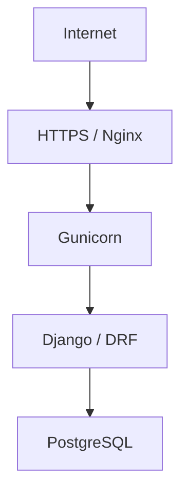

Figura 11 — Deployment de referência.

### 21.2 O que pode ser afirmado

- `IMPLEMENTADO`: há baseline documental e de configuração para essa topologia.
- `IMPLEMENTADO PARTIALLY`: o repositório suporta esse modo de implantação.
- não há evidência suficiente, apenas neste repositório, para afirmar que um ambiente definitivo do INS já esteja implantado e validado em operação real.

### 21.3 AWS, domínio e HTTPS

Não foi possível confirmar, a partir do repositório auditado, uma implantação específica em AWS EC2, um domínio público definitivo ou detalhes operacionais finais de certificado TLS em ambiente do INS. Por isso, esses itens não são apresentados aqui como fato implementado.

## 22. Backup e recuperação

O repositório possui documentação operacional específica para PostgreSQL backup e restore.

O que pode ser afirmado:

- `IMPLEMENTADO PARTIALLY`: existe procedimento documentado de backup e restore.
- não há evidência, neste repositório, de que o restore tenha sido operacionalmente validado em rotina de piloto.

### 22.1 Responsabilidades técnicas

O documento operacional indica a necessidade de:

- armazenar dumps fora do diretório da aplicação;
- realizar backup manual com `pg_dump`;
- restaurar em janela controlada;
- testar restore em banco temporário.

## 23. Healthcheck e observabilidade

### 23.1 Healthcheck atual

Existe endpoint `/api/health/` com verificação mínima da aplicação e do banco:

- executa `SELECT 1` no banco;
- retorna status simples de saúde.

Isso é usado também nos healthchecks dos arquivos compose.

### 23.2 Observabilidade atual

- `IMPLEMENTADO PARTIALLY`: healthcheck e logging básico configurável.
- `TO-BE`: observabilidade ampliada, logs estruturados e monitoramento institucional mais completo.

## 24. Deployment em alto nível

O repositório permite descrever um fluxo de publicação em alto nível sem expor dados sensíveis:

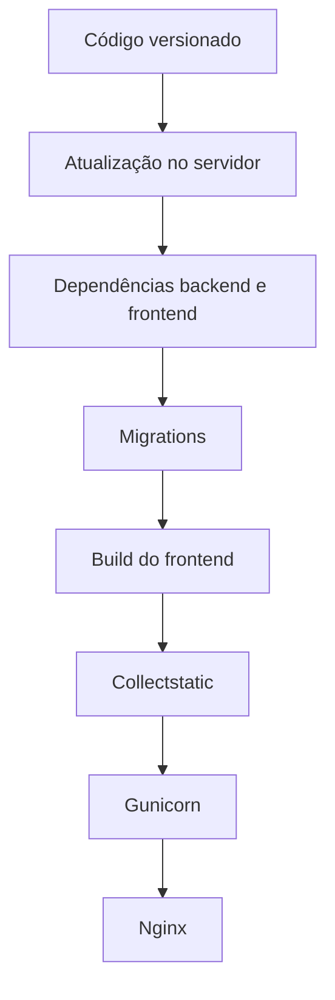

Figura 12 — Visão de alto nível do deployment.

Essa seção remete à documentação operacional já existente em `docs/deployment/`, em vez de reproduzir um tutorial operacional detalhado.

## 25. Evolução arquitetural para indicadores configuráveis

O repositório já possui base conceitual para reduzir dependência de indicadores hardcoded, mas ainda não completou a evolução.

### 25.1 Situação atual

- `IMPLEMENTADO PARTIALLY`: modelos versionados de módulo, variável e indicador.
- `IMPLEMENTADO PARTIALLY`: cálculo local e no dashboard baseado em metadados definidos no backend.
- `GAP`: builder administrativo, governança de aprovação, formula engine genérico e versionamento analítico completo.

### 25.2 Fluxo arquitetural-alvo

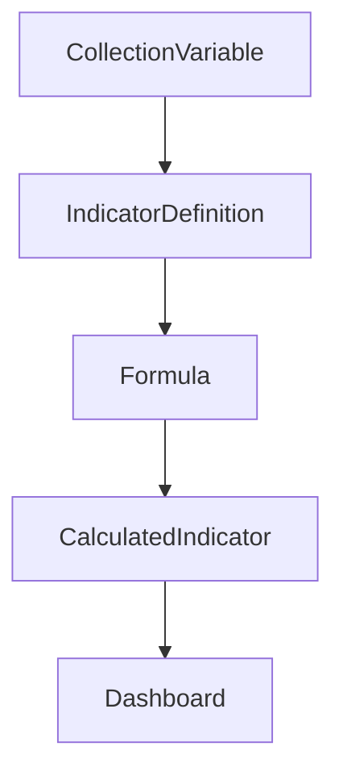

Figura 13 — Arquitetura evolutiva para indicadores configuráveis.

## 26. Indicator Builder

O indicator builder deve ser tratado como:

- `PROPOSTO`

Seu papel futuro seria permitir a definição administrativa de:

- nome;
- código;
- descrição;
- domínio;
- variáveis;
- numerador;
- denominador;
- fórmula;
- unidade;
- periodicidade;
- precisão;
- vigência;
- status.

Não há evidência de interface ou workflow implementado para essa finalidade no estado atual do repositório.

## 27. Formulários configuráveis

Outra linha de evolução conceitual identificada na documentação técnica é a possibilidade de configuração mais ampla do instrumento por entidades como:

- `ModuleDefinition`
- `SectionDefinition`
- `FieldDefinition`
- `ValidationRule`

Estado:

- `PROPOSTO`

Benefícios potenciais:

- menor rigidez do instrumento;
- redução de dependência de alterações em código para evoluções metodológicas;
- melhor governança do catálogo.

Riscos:

- aumento de complexidade de validação;
- maior exigência de versionamento e teste;
- necessidade de mecanismo seguro de configuração e publicação.

## 28. Formula Engine

O formula engine genérico também deve ser tratado como evolução:

- `PROPOSTO`

A arquitetura proposta, já descrita na baseline interna, prevê:

- cálculo determinístico;
- operadores e funções controlados;
- validação prévia de expressão;
- tratamento explícito de divisão por zero;
- tratamento de valores ausentes;
- versionamento de definição;
- cobertura de testes.

Não há evidência de execução arbitrária de fórmulas no protótipo atual, e essa ausência é arquiteturalmente positiva do ponto de vista de segurança.

## 29. Governança dos indicadores

O ciclo de governança proposto para o futuro é:

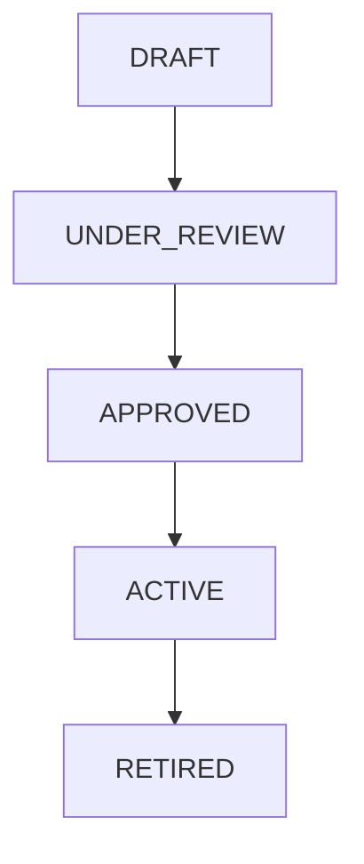

Figura 14 — Ciclo proposto de governança de indicadores.

Estado:

- `PROPOSTO`
- dependente de governança científica e institucional

## 30. Versionamento metodológico

Mudanças metodológicas relevantes devem gerar nova versão de indicador, por exemplo:

- alteração de fórmula;
- alteração de numerador;
- alteração de denominador;
- alteração de unidade;
- alteração de periodicidade.

O repositório já contém suporte estrutural inicial a `version`, `valid_from` e `valid_to`, mas ainda não implementa todo o ciclo de governança analítica histórica.

## 31. Matriz de maturidade consolidada

| Componente | Estado | Evidência | Principal gap / próximo passo |
| --- | --- | --- | --- |
| Backend Django/DRF | IMPLEMENTADO | apps, endpoints, testes | ampliar workflow institucional |
| Frontend React/PWA | IMPLEMENTADO | app router, páginas, testes | ampliar governança e cobertura responsiva real |
| PostgreSQL | IMPLEMENTADO | settings, compose, deploy docs | validar operação do piloto |
| PWA | IMPLEMENTADO | plugin PWA, assets e bootstrap local | capturas e validação operacional em campo |
| IndexedDB | IMPLEMENTADO | `indexedDb.ts` | sem compartilhamento entre dispositivos |
| Coleta | IMPLEMENTADO | collection service, form, E2E | refinamentos de governança |
| Múltiplas coletas | IMPLEMENTADO PARTIALLY | home/records/mobile report | consolidar regras operacionais institucionais |
| Sincronização | IMPLEMENTADO | sync engine, sync API, E2E | completar conflito e workflow pós-recebimento |
| Retry/backoff | IMPLEMENTADO | `markSyncError`, fila | política de operação em falhas persistentes |
| Idempotência | IMPLEMENTADO | `SyncBatchView`, teste backend | ampliar para cenários de conflito semântico |
| Dashboard | IMPLEMENTADO PARTIALLY | API, UI, testes | ampliar escopo analítico e governança |
| Indicadores | IMPLEMENTADO PARTIALLY | modelos, seed, dashboard | matriz final e builder administrativo |
| RBAC | IMPLEMENTADO PARTIALLY | `UserProfile`, restrição de auditoria | política institucional completa |
| Auditoria | IMPLEMENTADO PARTIALLY | `AuditEvent`, `eventHistory` | expandir rastreabilidade institucional |
| HTTPS baseline | IMPLEMENTADO PARTIALLY | settings e deploy docs | validação em ambiente público real |
| Deployment baseline | IMPLEMENTADO | docs e compose prod | confirmação de ambiente definitivo |
| Backup | IMPLEMENTADO PARTIALLY | runbook documentado | rotina operacional e validação |
| Restore | IMPLEMENTADO PARTIALLY | runbook documentado | teste operacional recorrente |
| Conflitos | GAP | statuses tipados e modelagem parcial | definir e implementar política |
| Indicator Builder | PROPOSTO | docs de indicadores | implementação e governança |
| Formula Engine | PROPOSTO | docs de indicadores | parser e execução segura |
| Schema configurável | PROPOSTO | baseline conceitual | modelagem e publicação segura |
| Edge Node | PROPOSTO / DEPENDE DO INS | docs offline | diagnóstico institucional |

## 32. Limitações atuais

As limitações mais relevantes identificadas pela auditoria são:

- workflow de revisão, devolução e aceite institucional ainda não implementado de ponta a ponta;
- resolução explícita de conflitos ainda ausente;
- governança definitiva dos indicadores ainda não consolidada no produto;
- matriz científica final ainda dependente de validação externa;
- operação multiusuário offline compartilhada não implementada;
- infraestrutura definitiva do INS não confirmada no repositório;
- validação de piloto e readiness completo ainda pendentes.

## 33. Dependências do INS

Há aspectos que não devem ser inferidos tecnicamente sem diagnóstico institucional:

- infraestrutura disponível;
- quantidade de usuários;
- quantidade de unidades;
- conectividade real;
- equipamentos disponíveis;
- rede local;
- estabilidade de energia;
- governança de acesso e revisão;
- fluxo de trabalho institucional;
- matriz definitiva de indicadores.

Todos esses itens permanecem como `DEPENDE DO INS` quando não houver validação formal refletida no repositório.

## 34. Roadmap técnico

Sem inventar datas, o roadmap técnico coerente com a documentação atual pode ser organizado assim:

1. Estágio 1 — MVP funcional
   Coleta local, persistência, sincronização básica, registros, dashboard inicial.
2. Estágio 2 — Consolidação técnica e gaps críticos
   Conflitos, robustez operacional, observabilidade e validações adicionais.
3. Estágio 3 — Governança e configurabilidade de indicadores
   Builder, versionamento, ciclo de aprovação.
4. Estágio 4 — Validação da estratégia offline/edge
   Decisão entre continuidade do modelo device-local e eventual edge node.
5. Estágio 5 — Readiness
   Infraestrutura, backup/restore, segurança e operação assistida.
6. Estágio 6 — Piloto
   Execução controlada no ambiente acordado com o INS.
7. Estágio 7 — Avaliação e evolução
   Ajustes metodológicos, analíticos e operacionais pós-piloto.

## 35. Figuras e screenshots previstas

[FIGURA — Tela inicial]  
[FIGURA — Formulário de coleta]  
[FIGURA — Dashboard geral]  
[FIGURA — Dashboard em dispositivo móvel]  
[FIGURA — Registros]  
[FIGURA — Sincronização]  

Essas figuras não foram inventadas nem geradas automaticamente nesta etapa. O repositório não contém screenshots de interface prontas para reaproveitamento; portanto, a captura real permanece uma atividade posterior.

## 36. Considerações finais

No estado atual de 12 de agosto de 2026, HEMO-ANGOLA já demonstra maturidade arquitetural suficiente para apresentação técnica séria a pesquisadores, professores e parceiros institucionais: há produto executável, arquitetura coerente, camada local-first real, sincronização idempotente, evidência de testes e documentação operacional de referência. Ao mesmo tempo, o repositório ainda deixa claros seus limites: a solução ainda não conclui a governança institucional do piloto, nem transforma automaticamente o protótipo em implantação institucional definitiva.

Essa combinação de implementação real com gaps explicitados é, hoje, a forma tecnicamente mais correta de apresentar a plataforma.

## 37. Documentos técnicos relacionados

- `docs/architecture/README.md`
- `docs/architecture/HEMO-ANGOLA-TECHNICAL-SPECIFICATION.md`
- `docs/architecture/02-functional-requirements.md`
- `docs/architecture/03-non-functional-requirements.md`
- `docs/architecture/requirements-traceability-matrix.md`
- `docs/architecture/ARCHITECTURE-AUDIT-V1.1.md`
- `docs/architecture/indicators/`
- `docs/architecture/offline/`
- `docs/architecture/infrastructure/`
- `docs/architecture/adr/`
- `docs/deployment/README.md`
- `docs/deployment/BACKUP-AND-RESTORE.md`
- `docs/deployment/PRODUCTION-READINESS-REPORT.md`
